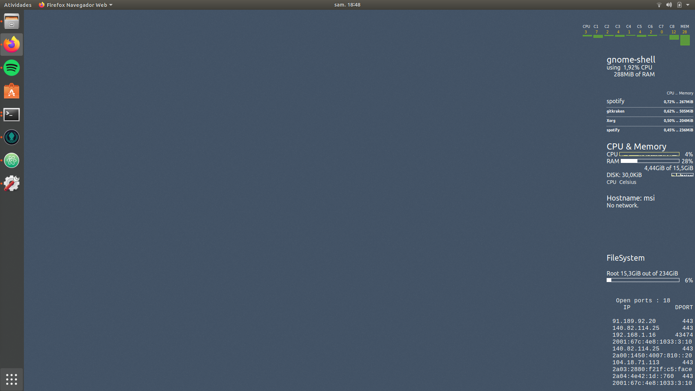

my-conky
====

My own conky files & conf.



To install the Conky Manager on a Debian-based system:

```
sudo apt-get install conky-all
sudo apt-add-repository -y ppa:teejee2008/ppa
sudo apt-get update
sudo apt-get install conky-manager
sudo apt install hddtemp lm-sensors
```

To enable Conky every time the PC turns on, follow these steps:

1. Copy-paste all the files inside these repo into your home folder.
2. Execute this command within the "Startup applications":

```
/home/manuel/conky-manager/conky-startup.sh
```
